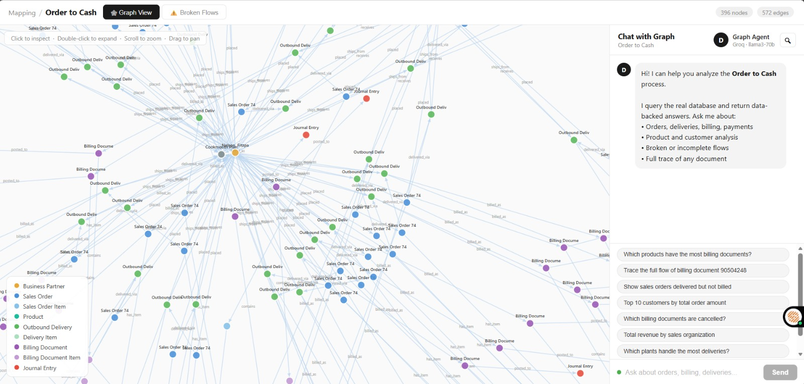
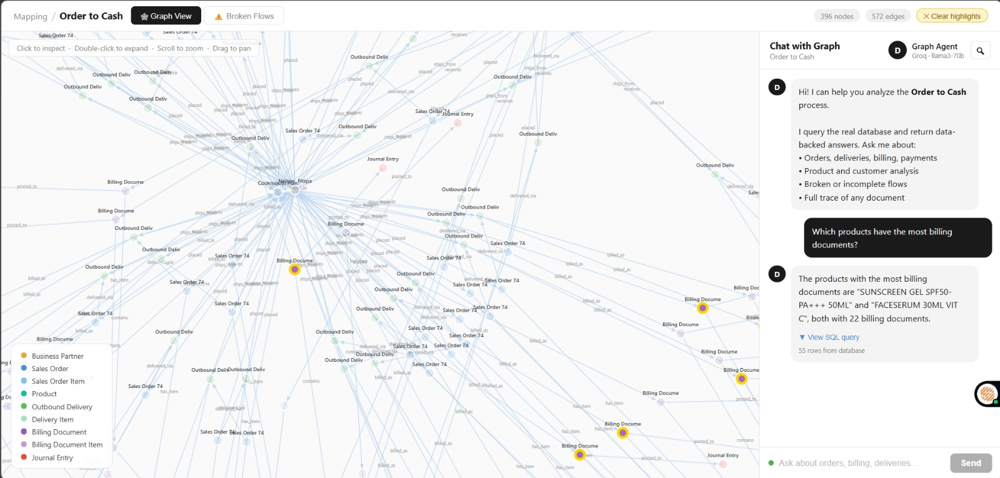
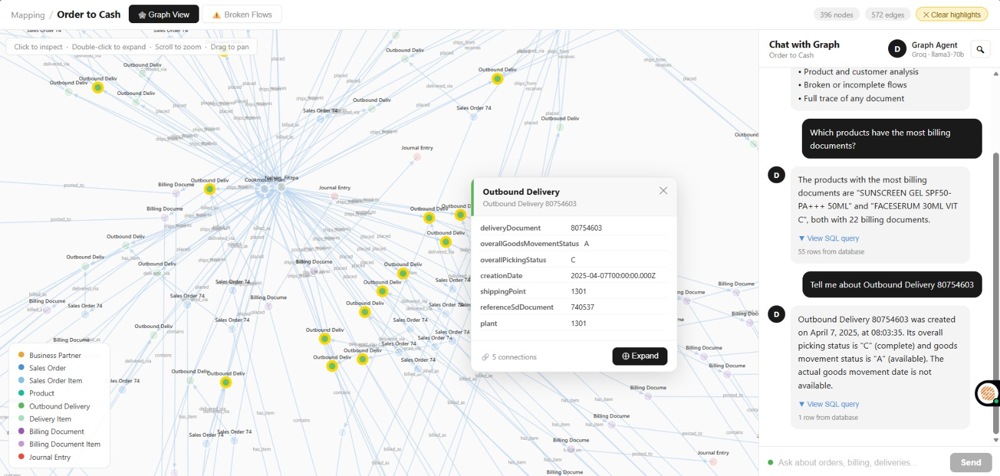
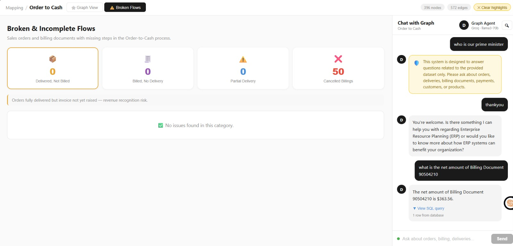
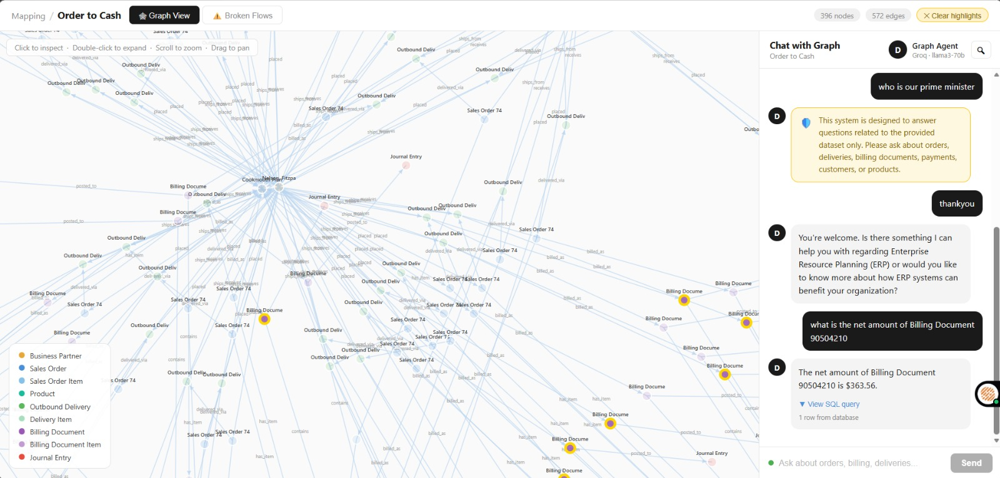

# 🚀 Order-to-Cash AI Agent — Graph-Based Data Modeling & Query System

## Overview

This project builds an **Order-to-Cash Graph API** that transforms ERP data (orders, deliveries, billing, and payments) into an interactive graph model.
It enables users to **visualize relationships between entities** and explore data through node expansion and metadata views.
A conversational interface powered by an LLM converts natural language queries into SQL, executes them on the database, and returns grounded insights.
The system also includes **trace flows, anomaly detection, and guardrails** to ensure accurate and domain-relevant responses.


---

## 🔗 Links

| Resource | URL |
|---|---|
| 🌐 Live Demo |https://dodge-ai-task-phi.vercel.app/|

---

## 📸 Screenshots

### Graph Visualization


### AI Chat Interface


### Node Expansion & Metadata


### Broken Flows Analysis


### Guardrails Analysis


---

## 🏗️ Architecture Overview

```
┌──────────────────────────────────────────────────────────────┐
│                        FRONTEND (React + Vite)               │
│   ┌────────────┐  ┌──────────────┐  ┌───────────────────┐   │
│   │ GraphView  │  │  ChatPanel   │  │ BrokenFlowsPanel  │   │
│   │  (D3.js)   │  │  (SSE/AI)    │  │   (Analytics)     │   │
│   └─────┬──────┘  └──────┬───────┘  └─────────┬─────────┘   │
└─────────┼────────────────┼──────────────────────┼────────────┘
          │                │                       │
          └────────────────▼───────────────────────┘
                           │ REST API
┌──────────────────────────▼──────────────────────────────────┐
│                   BACKEND (FastAPI + Python 3.11)            │
│                                                              │
│  ┌─────────────┐  ┌──────────────┐  ┌────────────────────┐  │
│  │ Graph Engine │  │  LLM Router  │  │  Guardrails Layer  │  │
│  │ get_graph()  │  │ Groq API KEYS│  │  Keyword + LLM     │  │
│  └──────┬───────┘  └──────┬───────┘  └────────────────────┘  │
│         │                 │                                    │
│  ┌──────▼─────────────────▼───────────────────────────────┐  │
│  │              SQLite (order_to_cash.db)                  │  │
│  │  sales_orders | deliveries | billing | payments | ...   │  │
│  └────────────────────────────────────────────────────────┘  │
└──────────────────────────────────────────────────────────────┘
```

---
## Architecture Decisions
 
> The system is split into two independent services:
 
**Backend — FastAPI (Python)**
Handles all data access, graph construction, SQL generation, and LLM calls. Kept separate from the frontend so the LLM logic and database are never exposed to the client. Deployed on Render.
 
**Frontend — React + Vite**
Renders the D3.js force graph and chat interface. Communicates with the backend via REST and Server-Sent Events for streaming. Deployed on Vercel.
 
```
User → React (Vercel)
          ↓ REST / SSE
       FastAPI (Render)
          ↓              ↓
       SQLite DB       Groq API
```
 
**Why this split?**  
The API key, SQL execution, and LLM prompts are all server-side. The frontend only receives final answers and graph data — no raw data or credentials are exposed.
 
---
 
## Database Choice — SQLite
 
The dataset (19 tables, ~1MB) is loaded from JSONL files into a single SQLite file at startup using `load_data.py`.
 
**Why SQLite:**
- Zero configuration — no separate database server needed
- The dataset is read-only after loading, so SQLite's write limitations don't matter
- Fast enough for analytical SELECT queries on this data size
- Single file makes deployment simple — the `.db` file is committed to the repo alongside the backend
 
**Trade-off:** If the dataset grew to millions of rows or needed concurrent writes, PostgreSQL would be the right choice. For this assignment, SQLite is the right fit.
 
---

## 📊 Graph Modelling

### Nodes (Business Entities)

| Node Type | Source Table | Description |
|---|---|---|
| **Business Partner** | `business_partners` | Customers / Sold-To parties |
| **Sales Order** | `sales_order_headers` | Customer purchase orders |
| **Sales Order Item** | `sales_order_items` | Line items within an order |
| **Product** | `products` + `product_descriptions` | Materials / SKUs |
| **Outbound Delivery** | `outbound_delivery_headers` | Shipments |
| **Plant** | `plants` | Shipping/storage locations |
| **Billing Document** | `billing_document_headers` | Invoices |
| **Billing Document Item** | `billing_document_items` | Invoice line items |
| **Journal Entry** | `payments_accounts_receivable` | Accounting/payment records |

### Edges (Relationships)

| Edge | Meaning |
|---|---|
| Business Partner → Sales Order | Customer placed this order |
| Sales Order → Sales Order Item | Order contains these items |
| Sales Order Item → Product | Item references this material |
| Sales Order → Outbound Delivery | Order was delivered via this shipment |
| Outbound Delivery → Plant | Delivery shipped from this plant |
| Outbound Delivery → Billing Document | Delivery was invoiced |
| Billing Document → Billing Document Item | Invoice line items |
| Billing Document → Journal Entry | Invoice posted to accounting |

### Key Design Decision: Multi-Anchor Seeding
The graph seeds simultaneously from **Customers**, **Billing Documents**, and **Journal Entries** to guarantee 100% entity coverage, rather than traversing from a single root node.

---

## 🤖 LLM Integration & Prompting Strategy

### Model
- **Groq API** (`llama-3.3-70b-versatile`) — fast inference, free tier
- **API keys in rotation** — prevents rate limiting; automatically falls back to next key

### Prompting Architecture

#### 1. Intent Classification (fast pre-filter)
```
Intent categories: DATA | SOCIAL | META | IRRELEVANT
- DATA  → Generate SQL and query the database
- SOCIAL → Respond conversationally (greetings, thanks)
- META  → Explain ERP concepts without querying DB
- IRRELEVANT → Return guardrail response
```

#### 2. Text-to-SQL Generation
The LLM receives a `SCHEMA_CONTEXT` prompt containing:
- All 9 table definitions with key columns and data types
- JOIN patterns for common cross-table queries
- Explicit entity name mappings (e.g. *"Journal Entry" → `payments_accounts_receivable` table*)
- Example queries for each entity type
- Strict rule: return `IRRELEVANT` if question is off-domain

#### 3. Natural Language Answer Generation
After SQL is executed, results (up to 15 rows) are passed back to the LLM with the instruction to answer **only based on the provided data** — preventing hallucination.

#### 4. Auto-Fix Loop
If the generated SQL throws an error, the system automatically sends the failing SQL + error message back to the LLM to self-correct, then retries.

---

## 🛡️ Guardrails

A **two-layer** guardrail system:

### Layer 1: Keyword Pre-Filter (fast, no LLM call)
- Allow-list of 60+ ERP domain keywords (`order`, `billing`, `delivery`, `journal`, `payment`, `partner`, etc.)
- Block-list of regex patterns for clearly off-topic requests (weather, recipes, crypto prices, jokes, etc.)

### Layer 2: LLM Intent Classification
- If keyword filter passes, an LLM call classifies intent as `DATA / SOCIAL / META / IRRELEVANT`
- `IRRELEVANT` returns: *"This system is designed to answer questions related to the provided Order-to-Cash dataset only."*

### Layer 3: SQL Safety Check
- Any SQL containing `INSERT`, `UPDATE`, `DELETE`, `DROP`, `CREATE`, or `ALTER` is rejected immediately
- Returns: *"Only read operations are permitted on this system."*

---

## 💬 Example Queries Supported

| Query | What the system does |
|---|---|
| *"Which products have the most billing documents?"* | SQL GROUP BY + COUNT on `billing_document_items` JOIN `product_descriptions` |
| *"Trace the full flow of billing document 90000001"* | Dedicated `/api/trace` endpoint: SO → Delivery → Billing → Journal |
| *"Show sales orders delivered but not billed"* | SQL: `overallDeliveryStatus='C' AND overallOrdReltdBillgStatus IN ('A','B')` |
| *"Tell me about Business Partner 320000083"* | SQL lookup on `business_partners` JOIN `sales_order_headers` |
| *"Tell me about Journal Entry 9400172476"* | SQL on `payments_accounts_receivable WHERE accountingDocument='9400172476'` |

---

## 🗂️ Project Structure

```
DODGE-AI/
├── backend/
│   ├── main.py              # FastAPI app — graph, chat, trace, analysis endpoints
│   ├── load_data.py         # Data ingestion from raw files to SQLite
│   ├── order_to_cash.db     # SQLite database (pre-populated)
│   └── requirements.txt     # Python dependencies
├── frontend/
│   ├── src/
│   │   ├── App.jsx          # Main layout, routing, graph state
│   │   ├── components/
│   │   │   ├── GraphView.jsx       # D3.js force-directed graph
│   │   │   ├── ChatPanel.jsx       # Streaming AI chat interface
│   │   │   └── BrokenFlowsPanel.jsx # Analytics dashboard
│   │   └── App.css          # Styling
│   └── vite.config.js
├── render.yaml              # Render deployment config
├── .python-version          # Pin Python 3.11 for Render
├── runtime.txt              # Heroku-style Python version pin
├── .gitignore
└── README.md
```

---

## 🚀 How to Run Locally

### Backend
```bash
cd backend
pip install -r requirements.txt
uvicorn main:app --reload
# API available at http://localhost:8000
```

### Frontend
```bash
cd frontend
npm install
npm run dev
# UI available at http://localhost:5173
```

### Environment Variables
Create a `.env` file in the project root:
```env
GROQ_KEY_1=your_groq_api_key_here
GROQ_KEY_2=...
# Add up to GROQ_KEY_11 for rate limit rotation
```

---

## 📌 Key Architectural Decisions & Tradeoffs

| Decision | Alternative | Why This Was Chosen |
|---|---|---|
| SQLite | PostgreSQL / Neo4j | Zero config, file-based, sufficient for dataset size |
| Graph computed at runtime | Stored graph (Neo4j) | Avoids sync complexity; relational data maps cleanly to edges |
| Groq llama-3.3-70b | OpenAI GPT-4 | Free tier, fast inference, sufficient capability |
| 11-key rotation | Single key + retry | Eliminates downtime from individual key rate limits |
| React + D3.js | React Flow / vis.js | Maximum control over node rendering and force simulation |
| SSE streaming | WebSockets | Simpler, stateless, works over standard HTTP |

---

## 🏆 Evaluation Criteria Coverage

| Criterion | Implementation |
|---|---|
| **Code quality** | Clean separation of concerns (graph/chat/trace/analysis), typed Pydantic models |
| **Graph modelling** | 9 node types, 8+ edge types, Multi-Anchor seeding for 100% coverage |
| **Database / storage** | SQLite with TEXT PKs matching SAP ID formats; indexed joins |
| **LLM integration** | Two-phase prompting (intent → SQL → answer), schema context, auto-fix loop |
| **Guardrails** | Three-layer system: keyword pre-filter + LLM classification + SQL safety |

---

*Built with FastAPI · SQLite · Groq · React · D3.js · Vite*
